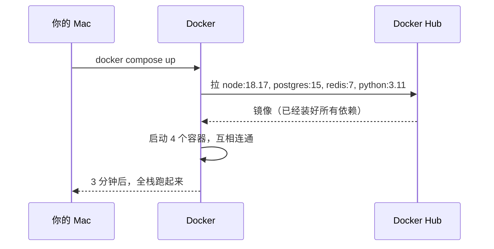
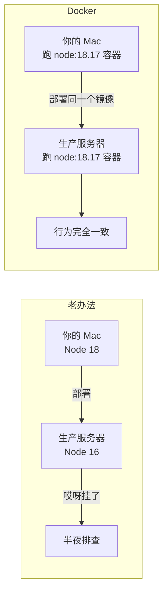

# 第 1 章 为什么需要 Docker

> 不解释"什么是容器化"——你已经听过无数次了。这一章只回答一个问题：**作为后端工程师，你的工作流里到底哪儿不舒服，Docker 是怎么解决的。**

## 1.1 真实场景：你今天的痛

假设你刚加入一家公司，第一天上手新项目。技术栈是：

- Node.js 后端（要求 Node 18.17）
- PostgreSQL 15（不能用 16，有兼容性问题）
- Redis 7
- 一个用 Python 写的定时任务（用了 Python 3.11 和 OpenCV）

你打开 README，看到这样的指引：

```bash
# 1. 装 Node 18.17（你本机是 20）
nvm install 18.17 && nvm use 18.17

# 2. 装 PostgreSQL 15（你本机已经有 14）
brew install postgresql@15
# ... 然后处理 service 冲突、端口占用、用户权限

# 3. 装 Redis 7
brew install redis

# 4. 装 Python 3.11（你本机是 3.13）
brew install python@3.11

# 5. 装 OpenCV（这一步在你的 M1 Mac 上要编译 30 分钟）
pip install opencv-python
```

**结果**：

::: danger 你的下午就这么没了
- PostgreSQL 14 和 15 的 `brew services` 互相打架，端口都是 5432
- `pip install opencv-python` 在 M1 上跑了 40 分钟，最后报错说缺 `libgl`
- 你装好了，旁边新来的同事又要从头来一遍
:::

这就是 Docker 解决的第一个问题：**环境一次描述，处处运行**。

## 1.2 同样的事，用 Docker 是什么样

新同事的 README 改成这样：

```bash
git clone <repo>
cd <repo>
docker compose up
```

**结束**。

`docker compose up` 这一条命令做了：



- 不污染你本机的 Node / Python / Postgres 版本
- 不和已经在跑的 PostgreSQL 14 冲突
- 删除项目时，`docker compose down -v` 一行擦干净

## 1.3 它解决的第二个问题：开发环境 ≡ 生产环境



经典名言：

> "在我电脑上是好的啊"
> —— 每个被叫去半夜排查的工程师

Docker 把这句话直接消灭了：你本地跑的镜像和生产跑的镜像**就是同一个二进制文件**，连同它的所有依赖、系统库、配置。

## 1.4 它**不**解决什么

为了避免你带着错误的预期入坑，先把它**不**能做的事说清楚：

#### ❌ 它不能

- **不**让你的应用变快（开销大约 1-3%，几乎可以忽略）
- **不**自动备份你的数据库（你还是得写备份脚本）
- **不**替代监控、日志聚合、APM
- **不**等于 Kubernetes（K8s 是用来编排成百上千个容器的）
- **不**让 Windows 上的 Linux 程序跑得跟原生 Linux 一样快（WSL2 有少量 IO 开销）

#### ✅ 它做的事

- 把"装环境"这件事**变成可复制的代码**
- 让"开发-测试-生产"环境差异**为零**
- 让"一台机器跑十个应用"互相不打架
- 让"回滚到上周版本"变成 `docker run image:v3` 一条命令

## 1.5 学习路径：你接下来 3 个章节会做什么

| 章节 | 你将做的事 | 预计时间 |
|------|----------|---------|
| 第 2 章 | 跑起人生第一个容器，理解镜像/容器/Volume 三个核心概念 | 30 分钟 |
| 第 3 章 | 用 Compose 把前端 + 后端 + 数据库 + Redis 编排成一个栈 | 1 小时 |
| 第 4 章 | 写出生产级 Dockerfile，配 CI/CD，避开 7 个新手会踩的坑 | 1.5 小时 |

## 本章要点

::: info Take-aways
1. Docker 解决两件事：**环境描述** + **环境一致性**
2. 它**不是**性能优化工具，**不是** K8s 的替代
3. 学它的成本不高（一个周末），收益是终身受用
:::

<a href="chapter-02.md" class="VPButton VPButton--primary">→ 第 2 章：跑起第一个容器</a>
