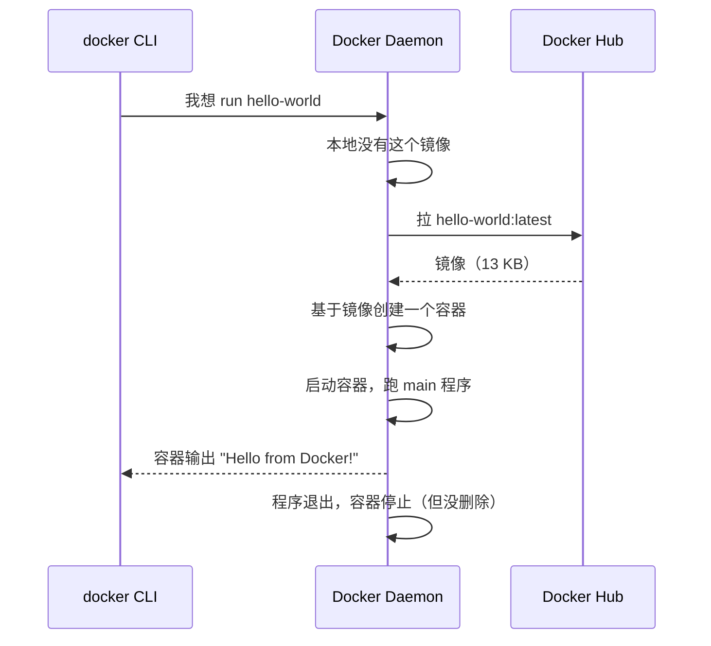
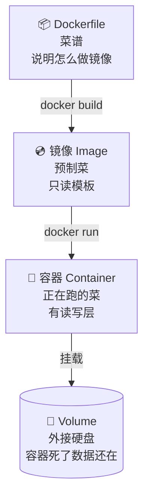

# 第 2 章 五分钟跑起第一个容器

> 这一章你将用十几条命令搞清楚 Docker 的三个核心概念：**镜像**、**容器**、**Volume**。所有命令都可以直接 copy 跑。

## 2.1 装 Docker（macOS）

::: tip macOS 用户推荐 OrbStack
Docker Desktop 在 M 芯片 Mac 上发热大、占内存。
[OrbStack](https://orbstack.dev/) 完全兼容 Docker CLI，**启动 2 秒，内存占用 1/10**。
:::

```bash
# Option A: Docker Desktop (官方)
brew install --cask docker

# Option B: OrbStack (强烈推荐 M 系列 Mac 用)
brew install --cask orbstack

# 验证安装
docker --version
# Docker version 27.x.x, build xxx
```

::: warning 国内拉镜像慢
Docker Hub 在国内访问不稳定。Docker Desktop 配置加速器：

```json [~/.docker/daemon.json]
{
  "registry-mirrors": [
    "https://docker.m.daocloud.io",
    "https://dockerproxy.com"
  ]
}
```

配完重启 Docker。
:::

## 2.2 第一条命令：让世界打个招呼

```bash
docker run hello-world
```

第一次跑的输出大致是：

```text
Unable to find image 'hello-world:latest' locally
latest: Pulling from library/hello-world
c1ec31eb5944: Pull complete
Digest: sha256:e0b569a5163a5e6be84e210a2587e7d447e08f87a0e90798363fa44a0464a1e8
Status: Downloaded newer image for hello-world:latest

Hello from Docker!
This message shows that your installation appears to be working correctly.
```

恭喜，你刚才发生了这些事：



## 2.3 三个核心概念



| 概念 | 类比 | 命令 |
|------|------|------|
| **镜像 (Image)** | 预制菜 / 模板 | `docker images` 列出 |
| **容器 (Container)** | 加热后的菜 / 运行中的进程 | `docker ps` 列出运行中的 |
| **Volume** | 外接硬盘 | `docker volume ls` 列出 |

::: info 记住这个区别
**一个镜像可以创建无数个容器**，就像一个预制菜包装能加热出无数顿饭。
**容器有生命周期**（创建 → 运行 → 退出 → 删除），但镜像永远是只读的。
:::

## 2.4 跑一个真实的服务：Nginx

```bash
# -d  后台跑
# -p  端口映射：宿主机 8080 → 容器内 80
# --name 给容器起个名
# nginx:alpine 用 Alpine 版（小，5MB vs 默认的 200MB）
docker run -d -p 8080:80 --name my-web nginx:alpine
```

浏览器打开 <http://localhost:8080> 就能看到 Nginx 欢迎页。

**常用观察命令**：

```bash
docker ps                    # 看正在跑的容器
docker ps -a                 # 看所有容器（包括已停止的）
docker logs my-web           # 看容器日志
docker logs -f my-web        # 持续 tail 日志
docker stats                 # 实时看 CPU/内存（像 top）
docker exec -it my-web sh    # 钻进容器里开个 shell
```

进入容器后，你会发现这是一个 Alpine Linux 的微缩世界：

```bash
$ docker exec -it my-web sh
/ # cat /etc/os-release
NAME="Alpine Linux"
VERSION_ID=3.19.x
/ # ls /usr/share/nginx/html
50x.html  index.html
/ # exit
```

**清理**：

```bash
docker stop my-web   # 停止
docker rm my-web     # 删除容器
docker rmi nginx:alpine  # 删除镜像（可选）
```

## 2.5 数据持久化：Volume

容器一删，里面的数据就没了。这对 Nginx 静态页面无所谓，对数据库**是灾难**。

### 反面教材

```bash
docker run -d --name pg-bad postgres:15
# 写了一堆数据进去...
docker rm -f pg-bad
# 💀 数据全没了
```

### 正确做法：挂 Volume

```bash
# 创建一个命名 Volume
docker volume create pgdata

# 启动 PostgreSQL，把数据目录挂到 Volume
docker run -d \
  --name pg-good \
  -e POSTGRES_PASSWORD=secret \
  -v pgdata:/var/lib/postgresql/data \
  -p 5432:5432 \
  postgres:15

# 写入一些数据
docker exec -it pg-good psql -U postgres -c "CREATE DATABASE myapp;"

# 删容器，再用同一个 Volume 重启
docker rm -f pg-good
docker run -d --name pg-good \
  -e POSTGRES_PASSWORD=secret \
  -v pgdata:/var/lib/postgresql/data \
  -p 5432:5432 \
  postgres:15

# 数据还在
docker exec -it pg-good psql -U postgres -c "\l" | grep myapp  # ✅
```

### Volume vs 绑定挂载

#### 命名 Volume（推荐数据库用）

```bash
-v pgdata:/var/lib/postgresql/data
```

Docker 帮你管路径，跨平台干净。

#### 绑定挂载（推荐开发期热重载用）

```bash
-v $(pwd)/src:/app/src
```

把你本地代码目录挂到容器里，改文件容器立刻看到。

## 2.6 自己造一个镜像

新建一个文件夹：

```bash
mkdir my-app && cd my-app
cat > app.js <<'EOF'
const http = require('http');
http.createServer((req, res) => {
  res.end(`Hello from ${process.env.HOSTNAME} at ${new Date().toISOString()}\n`);
}).listen(3000);
console.log('listening on :3000');
EOF
```

写 Dockerfile：

```dockerfile title="Dockerfile"
FROM node:18-alpine                  # (1)
WORKDIR /app                         # (2)
COPY app.js .                        # (3)
EXPOSE 3000                          # (4)
CMD ["node", "app.js"]               # (5)
```

1. 基础镜像，相当于 "从这个状态开始"
2. 容器内的工作目录，相当于 cd /app
3. 把本地文件复制进镜像
4. 文档性的端口声明（不实际打开端口，要靠 `-p`）
5. 容器启动时跑的命令

构建 + 运行：

```bash
docker build -t my-app:v1 .          # 把当前目录当 build context
docker run -d -p 3000:3000 my-app:v1

curl localhost:3000
# Hello from a3f9c2d4b1e7 at 2026-06-03T09:00:00.000Z
```

## 2.7 速查：你最常用的 20 条命令

```bash title="必背 20 条"
# 镜像
docker pull <image>              # 拉镜像
docker images                    # 列镜像
docker rmi <image>               # 删镜像
docker build -t <name>:<tag> .   # 构建镜像

# 容器
docker run [-d -p -v --name] <image>  # 跑容器
docker ps [-a]                   # 看容器
docker stop <id|name>            # 停
docker start <id|name>           # 启
docker restart <id|name>         # 重启
docker rm [-f] <id|name>         # 删（-f 强制删运行中的）

# 观察 + 调试
docker logs [-f] <id|name>       # 看日志
docker stats                     # 看资源
docker exec -it <id|name> sh     # 进容器
docker inspect <id|name>         # 详细信息（JSON）

# Volume / Network
docker volume ls
docker volume rm <name>
docker network ls
docker system prune -a           # 一键清理所有未用的镜像/容器/网络
```

## 本章要点

::: info Take-aways
- **镜像** = 模板，**容器** = 运行中的实例
- 容器**默认不持久化数据**，关键数据要挂 Volume
- `docker build` + Dockerfile 让你能造任意自定义镜像
- 20 条命令覆盖 90% 的日常使用
:::

下一章我们把 4 个容器（前端 + 后端 + DB + Redis）用一个文件编排起来。

<a href="chapter-03.md" class="VPButton VPButton--primary">→ 第 3 章：Compose 编排</a>
