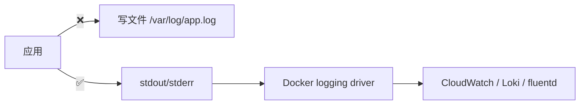
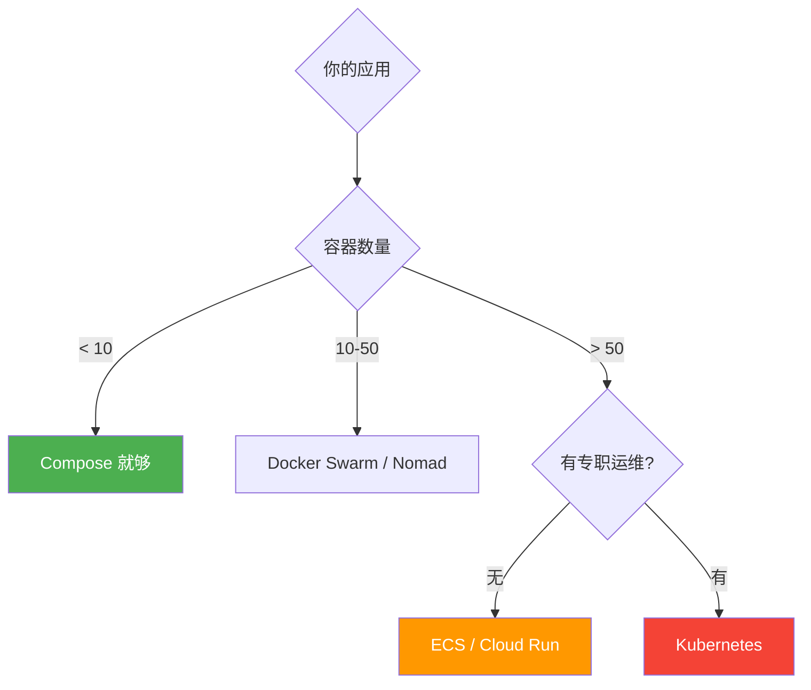
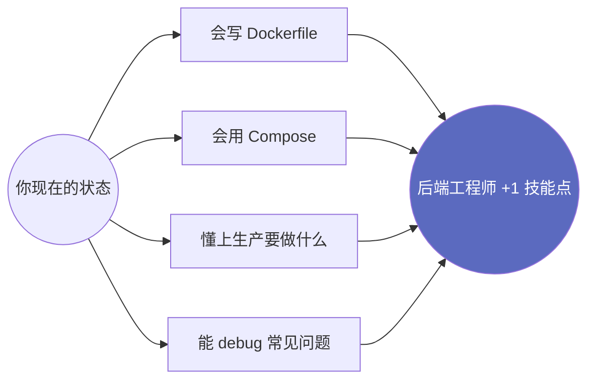

# 第 5 章 CCCC

> 本地跑通是一回事，上生产是另一回事。这一章是**所有踩过坑的工程师都会回头来翻**的一章。

## 4.1 写出"生产级" Dockerfile 的 7 条铁律

### ① 用具体版本，绝不用 latest

```dockerfile
# ❌ 灾难现场
FROM node:latest

# ✅ 锁版本到 minor
FROM node:18.17-alpine

# ✅✅ 锁到 digest（最严格，CI/CD 推荐）
FROM node:18.17-alpine@sha256:f77a1aef2da8d83e45ec990f45df50f1a286c5fe8bbfb8c6e4246c6389705c0b
```

`latest` 在不同时间拉到的不是同一个东西，构建结果不可复现。

### ② 用多阶段构建，把构建依赖摔掉

```dockerfile title="❌ 不分阶段：镜像 800MB"
FROM node:18-alpine
WORKDIR /app
COPY package*.json ./
RUN npm ci                       # 装了 devDependencies
COPY . .
RUN npm run build
CMD ["node", "dist/index.js"]
# 镜像里塞着 node_modules（含 typescript、webpack...）
```

```dockerfile title="✅ 多阶段：镜像 120MB"
# ─── 阶段 1: 构建 ───
FROM node:18-alpine AS builder
WORKDIR /app
COPY package*.json ./
RUN npm ci
COPY . .
RUN npm run build && npm prune --production   # 删掉 devDependencies

# ─── 阶段 2: 运行 ───
FROM node:18-alpine
WORKDIR /app
COPY --from=builder /app/dist ./dist
COPY --from=builder /app/node_modules ./node_modules
COPY --from=builder /app/package.json .
USER node
CMD ["node", "dist/index.js"]
```

### ③ 利用层缓存：变化少的放前面

Docker 一层一层 build，**改动靠后的层不影响前面的层缓存**。

```dockerfile
# ❌ 改一行代码就重新 npm ci
COPY . .
RUN npm ci

# ✅ 只有 package*.json 变了才重新 npm ci
COPY package*.json ./
RUN npm ci
COPY . .
```

### ④ 不要以 root 跑应用

```dockerfile
# ❌ 默认 root，安全风险
CMD ["node", "index.js"]

# ✅ 切到非 root
RUN addgroup -S app && adduser -S -G app app
USER app
CMD ["node", "index.js"]
```

### ⑤ 加 .dockerignore，避免把垃圾塞进镜像

```text title=".dockerignore"
node_modules
.git
.env
.env.*
*.md
.vscode
.idea
coverage
dist
*.log
.DS_Store
```

少这一行 `node_modules`，你的镜像可能多 500MB **而且**还会覆盖容器内的 `npm ci`。

### ⑥ 用 HEALTHCHECK 让 orchestrator 知道你死没死

```dockerfile
HEALTHCHECK --interval=30s --timeout=3s --start-period=10s --retries=3 \
  CMD wget --no-verbose --tries=1 --spider http://localhost:3000/health || exit 1
```

K8s / Compose / ECS 都会根据这个决定要不要把流量切走、要不要重启你的容器。

### ⑦ 暴露 PORT 用 ENV，别 hardcode

```dockerfile
ENV PORT=3000
EXPOSE ${PORT}
CMD ["node", "index.js"]
```

K8s 经常给你随机分配端口，应用要从 `process.env.PORT` 读。

## 4.2 镜像大小：你能做的事

| 措施 | 节省 |
|------|------|
| 用 `node:18-alpine` 而非 `node:18` | -800MB |
| 多阶段构建 | -300MB |
| `npm prune --production` | -200MB |
| 加 `.dockerignore` | -变量 |
| 用 `distroless` 镜像 | 极致小，但调试麻烦 |

```dockerfile title="distroless 极致版（80MB）"
FROM node:18-alpine AS builder
WORKDIR /app
COPY package*.json ./
RUN npm ci --production
COPY . .

FROM gcr.io/distroless/nodejs18-debian12
WORKDIR /app
COPY --from=builder /app .
USER nonroot
CMD ["index.js"]
```

::: warning distroless 没有 sh
`docker exec -it container sh` 会报错。
调试时临时用 `:debug` 标签，里面有 busybox。
:::

## 4.3 日志：12-Factor 的金律



**永远写到 stdout/stderr**，让 Docker / K8s 接管。

```javascript
// ❌
const fs = require('fs');
fs.appendFile('app.log', JSON.stringify({ event, ts: Date.now() }) + '\n');

// ✅
console.log(JSON.stringify({ event, ts: Date.now() }));
```

配置 logging driver：

```yaml title="docker-compose.yml"
services:
  api:
    image: my-api:v1
    logging:
      driver: "json-file"           # 默认
      options:
        max-size: "10m"             # 单文件最大 10M
        max-file: "3"               # 保留 3 个
```

否则日志能涨到几十 GB 把磁盘吃光（这真的发生过）。

## 4.4 安全：上线前 30 秒清单

- [x] 用了具体版本，不是 `latest`
- [x] `.env` 在 `.gitignore` 里
- [x] Dockerfile 切了非 root 用户
- [x] 暴露的端口最小化
- [x] 镜像扫过漏洞（`docker scout cves <image>` 或 [Trivy](https://trivy.dev/)）
- [x] Secrets 不在 image 层里（用 BuildKit 的 `--secret` 或运行时挂载）
- [x] 容器 readonly root filesystem 时仍能跑（设 `read_only: true` 测一下）
- [x] 配了资源限制（CPU / 内存）
- [x] HEALTHCHECK 写了
- [x] 日志接到了聚合系统

## 4.5 CI/CD：GitHub Actions 自动构建并推到 Registry

```yaml title=".github/workflows/build-image.yml"
name: Build & Push Image
on:
  push:
    branches: [main]
    tags: ['v*']

jobs:
  build:
    runs-on: ubuntu-latest
    permissions:
      contents: read
      packages: write
    steps:
      - uses: actions/checkout@v4

      - name: Set up Docker Buildx
        uses: docker/setup-buildx-action@v3

      - name: Login to GHCR
        uses: docker/login-action@v3
        with:
          registry: ghcr.io
          username: ${{ github.actor }}
          password: ${{ secrets.GITHUB_TOKEN }}

      - name: Extract metadata
        id: meta
        uses: docker/metadata-action@v5
        with:
          images: ghcr.io/${{ github.repository }}
          tags: |
            type=ref,event=branch
            type=semver,pattern={{version}}
            type=sha,prefix=sha-

      - name: Build and push
        uses: docker/build-push-action@v5
        with:
          context: .
          push: true
          tags: ${{ steps.meta.outputs.tags }}
          labels: ${{ steps.meta.outputs.labels }}
          cache-from: type=gha
          cache-to: type=gha,mode=max
          platforms: linux/amd64,linux/arm64
```

push 到 main → 自动打包 → 推到 `ghcr.io/your-org/repo:main`。
打 tag `v1.2.0` → 自动多 tag `v1.2.0` / `1.2` / `1` / `latest`。

## 4.6 7 个新手必踩的坑

::: details 坑 1：构建巨慢，每次都从头来
没用 BuildKit 缓存。CI 里加 `cache-from: type=gha`，本地用 `DOCKER_BUILDKIT=1 docker build`。
:::

::: details 坑 2：M1 Mac 构建的镜像推上去线上跑不起来
macOS 是 arm64，生产是 amd64。要么用 `--platform linux/amd64` 构建，要么用 `docker buildx` 多平台构建。
:::

::: details 坑 3：容器里 `localhost` 访问不到宿主机服务
容器的 localhost 是容器自己，不是 Mac。
用 `host.docker.internal`（仅 Desktop / OrbStack）或直接连服务名。
:::

::: details 坑 4：写了 EXPOSE 但端口还是访问不到
`EXPOSE` 只是文档，不开端口。要 `docker run -p 3000:3000` 或 Compose 写 `ports`。
:::

::: details 坑 5：容器秒退，logs 看不到原因
用 `docker logs <id>`（不是 `docker logs <name>`，有时容器还没注册名字就死了）。
或者 `docker run` 不加 `-d` 直接前台跑看错误。
:::

::: details 坑 6：磁盘被吃光
`docker system df` 看占用，`docker system prune -a --volumes` 一键清。
生产服务器上配 logging 的 `max-size` 和 `max-file`。
:::

::: details 坑 7：改了 Dockerfile 但 `docker run` 还是老行为
Dockerfile 改了要 **重新 build**：
`docker compose up -d --build`，或单独 `docker build -t ... && docker run ...`。
:::

## 4.7 进阶：什么时候该上 Kubernetes



**别为了用 K8s 而用 K8s**。K8s 复杂度极高，没专人运维很容易翻车。

| 场景 | 推荐方案 |
|------|---------|
| 单机 Side Project | Compose + 一台 VPS |
| 公司中型项目 | ECS / Cloud Run / Fly.io |
| 大规模分布式 | K8s（有专人） |

## 本书完结撒花 🎉



::: info 送你一句话
工具是手段不是目的。Docker 不会让你成为更好的工程师，但它会**减少**让你成为更差工程师的因素。
:::

<a href="../index.md" class="VPButton">← 回到首页</a>
<a href="../about.md" class="VPButton">👀 关于本书</a>
