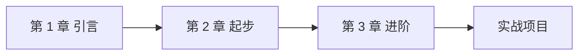

# 第 1 章 引言

## 1.1 这本书想解决什么问题

这里写引言。

## 1.2 阅读路线



## 1.3 一个代码示例

```python title="hello.py" linenums="1"
def hello(name: str) -> str:
    """问候用户"""
    return f"Hello, {name}!"

if __name__ == "__main__":
    print(hello("世界"))  # (1)
```

1. 这是一个代码注解，鼠标悬停在 (1) 上会显示这条说明。

!!! note "小贴士"
    Material 主题的代码块支持一键复制、行号、注解、高亮等丰富功能。

!!! warning "注意"
    本章为示例占位，请替换为你的真实内容。

## 1.4 任务清单

- [x] 完成大纲
- [x] 写第一章
- [ ] 写第二章
- [ ] 校对全书
