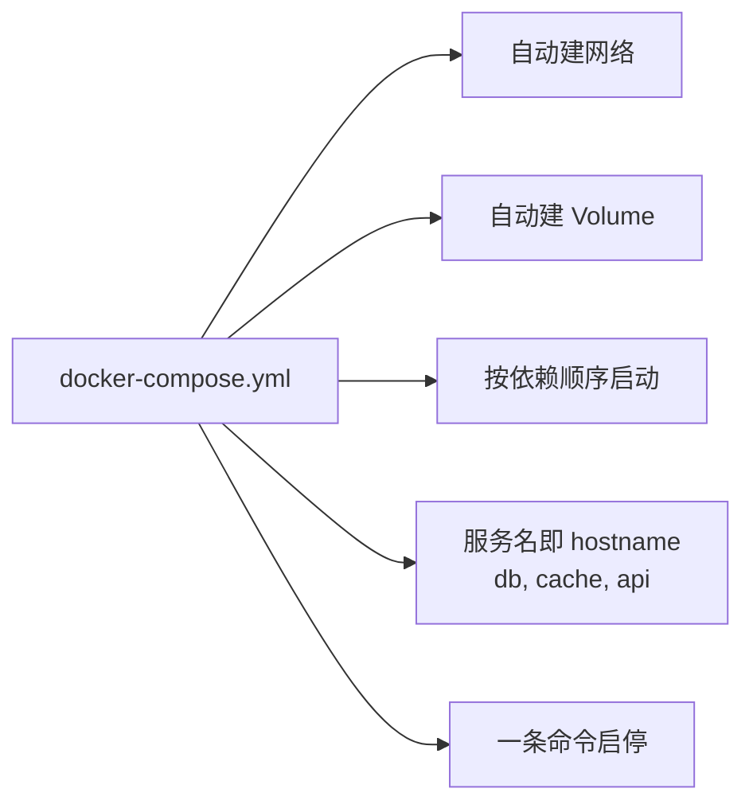

# 第 3 章 Compose 编排多服务

> 真实项目从来不是"一个容器"，而是 N 个服务。这一章用一个真实例子：**前端 (Nginx) + 后端 (Node.js) + 数据库 (PostgreSQL) + 缓存 (Redis)** 教你 Compose。

## 3.1 痛点：4 个容器你要敲多少命令

如果不用 Compose，启动这 4 个容器你要：

```bash
docker network create app-net

docker volume create pgdata
docker volume create redisdata

docker run -d --name db \
  --network app-net \
  -e POSTGRES_PASSWORD=secret \
  -v pgdata:/var/lib/postgresql/data \
  postgres:15

docker run -d --name cache \
  --network app-net \
  -v redisdata:/data \
  redis:7-alpine

docker run -d --name api \
  --network app-net \
  -e DATABASE_URL=postgres://postgres:secret@db:5432/postgres \
  -e REDIS_URL=redis://cache:6379 \
  -p 3000:3000 \
  my-api:v1

docker run -d --name web \
  --network app-net \
  -p 80:80 \
  -v $(pwd)/nginx.conf:/etc/nginx/nginx.conf:ro \
  nginx:alpine
```

**问题**：

- 命令长到记不住
- 启动顺序得自己控制
- 团队成员要一字不差敲一遍
- 没法 review，没法版本化

## 3.2 同一件事，用 Compose

写一个 `docker-compose.yml`：

```yaml title="docker-compose.yml"
services:
  db:
    image: postgres:15
    environment:
      POSTGRES_PASSWORD: ${DB_PASSWORD:-secret}
    volumes:
      - pgdata:/var/lib/postgresql/data
    healthcheck:
      test: ["CMD-SHELL", "pg_isready -U postgres"]
      interval: 5s
      retries: 5

  cache:
    image: redis:7-alpine
    volumes:
      - redisdata:/data
    healthcheck:
      test: ["CMD", "redis-cli", "ping"]
      interval: 5s

  api:
    build: ./api
    environment:
      DATABASE_URL: postgres://postgres:${DB_PASSWORD:-secret}@db:5432/postgres
      REDIS_URL: redis://cache:6379
    depends_on:
      db: { condition: service_healthy }
      cache: { condition: service_healthy }
    ports:
      - "3000:3000"

  web:
    image: nginx:alpine
    ports:
      - "80:80"
    volumes:
      - ./nginx.conf:/etc/nginx/nginx.conf:ro
    depends_on:
      - api

volumes:
  pgdata:
  redisdata:
```

然后：

```bash
docker compose up -d        # 启动全栈
docker compose ps           # 看状态
docker compose logs -f api  # 看 api 日志
docker compose down         # 停掉
docker compose down -v      # 停掉并删 Volume（数据也没了）
```

**结束**。

## 3.3 Compose 帮你解决了什么



### 自动 DNS：服务名互相能解析

在 `api` 容器里访问数据库不用写 IP，直接用服务名 `db`：

```javascript
// api 容器内代码
const pool = new pg.Pool({
  host: 'db',        // ← Compose 自动把 "db" 解析成数据库容器的 IP
  port: 5432,
  user: 'postgres',
  password: process.env.DB_PASSWORD,
});
```

### healthcheck + depends_on：等数据库真的就绪再启动 API

旧版 Compose 的 `depends_on` 只等容器**启动**，不等服务**就绪**——数据库容器秒起，但 Postgres 进程还要 3 秒才能接受连接，API 会启动失败。

新版用 `condition: service_healthy`：

```yaml
api:
  depends_on:
    db: { condition: service_healthy }   # 等 healthcheck 通过
```

## 3.4 实战：开发模式 vs 生产模式

开发期你希望改代码立刻生效，生产期你希望镜像不可变。用 **override 文件**做切换：

=== "docker-compose.yml（共用）"

    ```yaml
    services:
      api:
        build: ./api
        environment:
          DATABASE_URL: postgres://...
        depends_on:
          - db
    ```

=== "docker-compose.override.yml（开发，默认加载）"

    ```yaml
    services:
      api:
        volumes:
          - ./api/src:/app/src   # 挂载代码热重载
        command: npm run dev
        environment:
          NODE_ENV: development
        ports:
          - "9229:9229"          # 暴露 Node 调试端口
    ```

=== "docker-compose.prod.yml（生产，显式指定）"

    ```yaml
    services:
      api:
        image: registry.example.com/api:v3.2.1
        restart: always
        deploy:
          resources:
            limits: { cpus: '1', memory: 512M }
    ```

用法：

```bash
# 开发：自动加载 override
docker compose up -d

# 生产：显式合并
docker compose -f docker-compose.yml -f docker-compose.prod.yml up -d
```

## 3.5 .env 文件：把密码从 yaml 里拽出来

不要把 `POSTGRES_PASSWORD=secret` 写死在 yaml 里 commit 进 git。

```bash title=".env (不要 commit)"
DB_PASSWORD=correcthorsebatterystaple
JWT_SECRET=very-long-random-string
SENTRY_DSN=https://xxx@sentry.io/xxx
```

```bash title=".gitignore"
.env
.env.local
```

```bash title=".env.example (要 commit，给同事参考)"
DB_PASSWORD=changeme
JWT_SECRET=changeme
SENTRY_DSN=
```

Compose 自动加载同目录的 `.env`，yaml 里用 `${DB_PASSWORD}` 引用：

```yaml
db:
  environment:
    POSTGRES_PASSWORD: ${DB_PASSWORD}     # 来自 .env
```

## 3.6 Compose 配置全景

| 字段 | 干什么 | 例子 |
|------|--------|------|
| `image` | 用现成镜像 | `postgres:15` |
| `build` | 用本地 Dockerfile 构建 | `./api` |
| `ports` | 端口映射 | `"3000:3000"` |
| `volumes` | 挂载 | `pgdata:/var/lib/postgresql/data` |
| `environment` | 环境变量 | `KEY: value` |
| `env_file` | 从文件读环境变量 | `.env.production` |
| `depends_on` | 依赖关系 | `db: { condition: service_healthy }` |
| `healthcheck` | 健康检查 | 见 3.2 节例子 |
| `restart` | 退出策略 | `always` / `unless-stopped` |
| `networks` | 网络隔离 | 多服务分组到不同 network |
| `profiles` | 条件启用 | 只在 `--profile debug` 时启 |
| `deploy.resources` | 资源限制 | CPU / 内存上限 |
| `logging` | 日志驱动配置 | 接 fluentd / loki |

## 3.7 常见错误

!!! danger "❌ Volume 路径写反"
    ```yaml
    volumes:
      - /var/lib/postgresql/data:pgdata    # 反了！
      - pgdata:/var/lib/postgresql/data    # 正确：Volume 名:容器内路径
    ```

!!! danger "❌ 改了 yaml 但没重启"
    ```bash
    # 改完 docker-compose.yml 后必须：
    docker compose up -d         # ← 这个会自动检测变化重建
    # 不是
    docker compose restart       # ← 这个只重启，不会应用配置变化
    ```

!!! danger "❌ 把 .env 提交到 git"
    一旦推到公网仓库，密码就泄露了。
    立刻 [用 git-filter-repo 重写历史](https://github.com/newren/git-filter-repo) + 轮换所有密钥。

## 本章要点

!!! abstract "Take-aways"
    - Compose 把"一堆 docker run 命令"变成**一个可版本化的 yaml**
    - **服务名即 hostname**：容器之间互相用名字访问
    - **healthcheck + depends_on** 解决启动顺序
    - 开发 vs 生产：用 **override 文件**切换
    - 密码用 **.env**，永远不要 commit

下一章我们看上生产前必须做的事。

[→ 第 4 章：上生产](chapter-04.md){ .md-button .md-button--primary }
